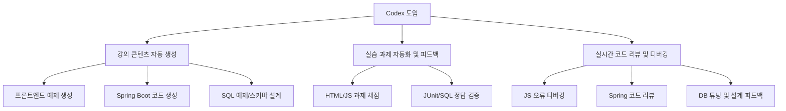

# Codex 활용 개요 - Mermaid 시각화

```mermaid
graph TD
    A[Codex 도입] --> B[강의 콘텐츠 자동 생성]
    A --> C[실습 과제 자동화 및 피드백]
    A --> D[실시간 코드 리뷰 및 디버깅]
    B --> B1[프론트엔드 예제 생성]
    B --> B2[Spring Boot 코드 생성]
    B --> B3[SQL 예제/스키마 설계]
    C --> C1[HTML/JS 과제 채점]
    C --> C2[JUnit/SQL 정답 검증]
    D --> D1[JS 오류 디버깅]
    D --> D2[Spring 코드 리뷰]
    D --> D3[DB 튜닝 및 설계 피드백]
```
