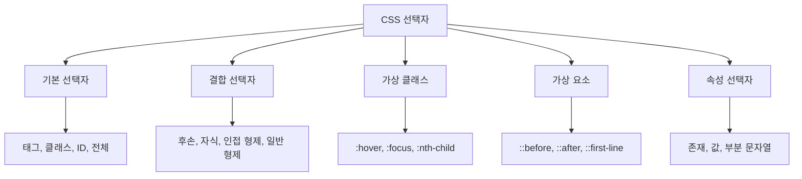

# CSS3 기본 숙지사항 - 취준생용 강의자료

## 📋 목차
1. [CSS3 개요](#css3-개요)
2. [선택자와 우선순위](#선택자와-우선순위)
3. [박스 모델](#박스-모델)
4. [레이아웃 시스템](#레이아웃-시스템)
5. [반응형 디자인](#반응형-디자인)
6. [애니메이션과 트랜지션](#애니메이션과-트랜지션)
7. [고급 기법](#고급-기법)
8. [실무 체크리스트](#실무-체크리스트)

---

## CSS3 개요

### CSS3란?
- **Cascading Style Sheets version 3**
- HTML 문서의 스타일과 레이아웃을 정의
- 브라우저별 점진적 개선 지원
- 모듈화된 구조로 개발

### CSS3 주요 특징
```mermaid
graph TD
    A[CSS3 특징] --> B[새로운 선택자]
    A --> C[레이아웃 모듈]
    A --> D[비주얼 효과]
    A --> E[반응형 지원]
    A --> F[웹폰트]
    
    B --> B1[속성 선택자, 가상 클래스]
    C --> C1[Flexbox, Grid]
    D --> D1[그라디언트, 그림자, 애니메이션]
    E --> E1[미디어 쿼리]
    F --> F1[@font-face, 웹폰트 로딩]
```

### CSS 작성 방법
```css
/* 1. 인라인 스타일 (권장하지 않음) */
<p style="color: red;">텍스트</p>

/* 2. 내부 스타일시트 */
<style>
  p { color: red; }
</style>

/* 3. 외부 스타일시트 (권장) */
<link rel="stylesheet" href="styles.css">

/* 4. @import (성능상 권장하지 않음) */
<style>
  @import url('styles.css');
</style>
```

---

## 선택자와 우선순위

### CSS 선택자 종류


### 선택자 예제
```css
/* 기본 선택자 */
* { margin: 0; }                    /* 전체 