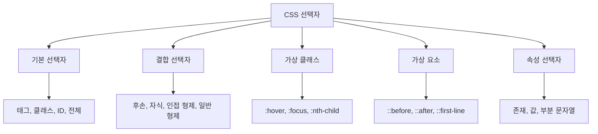
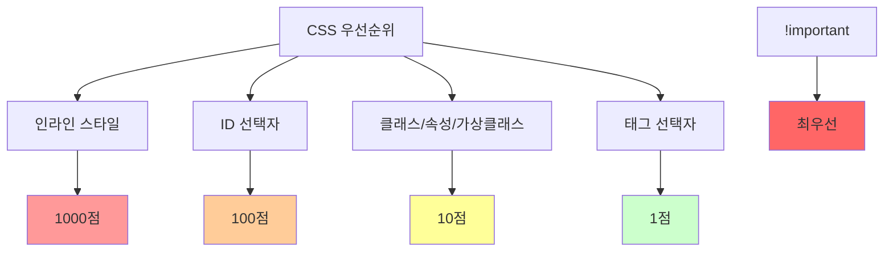
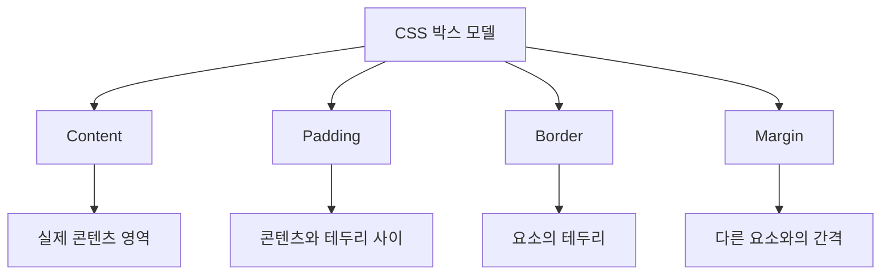
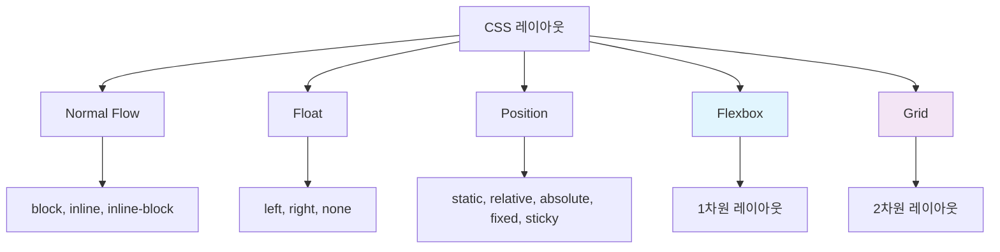
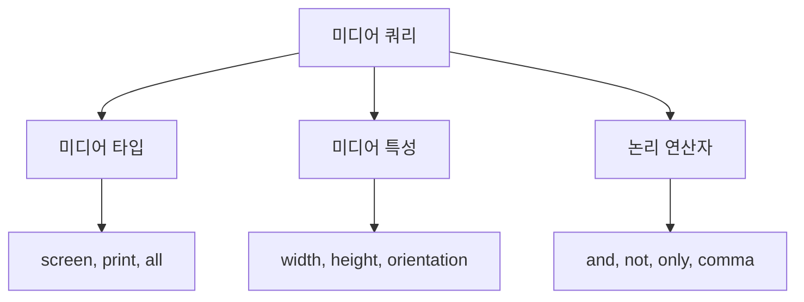
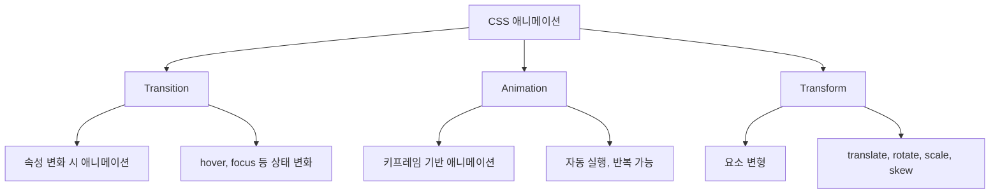

# CSS3 기본 숙지사항 - 취준생용 강의자료

## 📋 목차
1. [CSS3 개요](#css3-개요)
2. [선택자와 우선순위](#선택자와-우선순위)
3. [박스 모델](#박스-모델)
4. [레이아웃 시스템](#레이아웃-시스템)
5. [반응형 디자인](#반응형-디자인)
6. [애니메이션과 트랜지션](#애니메이션과-트랜지션)
7. [고급 기법](#고급-기법)
8. [실무 체크리스트](#실무-체크리스트)

---

## CSS3 개요

### CSS3란?
- **Cascading Style Sheets version 3**
- HTML 문서의 스타일과 레이아웃을 정의
- 브라우저별 점진적 개선 지원
- 모듈화된 구조로 개발

### CSS3 주요 특징
```mermaid
graph TD
    A[CSS3 특징] --> B[새로운 선택자]
    A --> C[레이아웃 모듈]
    A --> D[비주얼 효과]
    A --> E[반응형 지원]
    A --> F[웹폰트]
    
    B --> B1[속성 선택자, 가상 클래스]
    C --> C1[Flexbox, Grid]
    D --> D1[그라디언트, 그림자, 애니메이션]
    E --> E1[미디어 쿼리]
    F --> F1[@font-face, 웹폰트 로딩]
```

### CSS 작성 방법
```css
/* 1. 인라인 스타일 (권장하지 않음) */
<p style="color: red;">텍스트</p>

/* 2. 내부 스타일시트 */
<style>
  p { color: red; }
</style>

/* 3. 외부 스타일시트 (권장) */
<link rel="stylesheet" href="styles.css">

/* 4. @import (성능상 권장하지 않음) */
<style>
  @import url('styles.css');
</style>
```

---

## 선택자와 우선순위

### CSS 선택자 종류


### 선택자 예제
```css
/* 기본 선택자 */
* { margin: 0; }                    /* 전체 선택자 */
h1 { color: blue; }                 /* 태그 선택자 */
.header { background: #f0f0f0; }    /* 클래스 선택자 */
#main { width: 100%; }              /* ID 선택자 */

/* 결합 선택자 */
div p { color: red; }               /* 후손 선택자 */
div > p { font-weight: bold; }      /* 자식 선택자 */
h1 + p { margin-top: 0; }           /* 인접 형제 선택자 */
h1 ~ p { color: gray; }             /* 일반 형제 선택자 */

/* 가상 클래스 선택자 */
a:hover { color: red; }             /* 마우스 오버 */
input:focus { border-color: blue; } /* 포커스 */
li:first-child { font-weight: bold; } /* 첫 번째 자식 */
li:nth-child(2n) { background: #f0f0f0; } /* 짝수 번째 */
li:nth-child(odd) { background: #e0e0e0; } /* 홀수 번째 */

/* 가상 요소 선택자 */
p::before { content: "★ "; }       /* 요소 앞에 콘텐츠 추가 */
p::after { content: " ★"; }        /* 요소 뒤에 콘텐츠 추가 */
p::first-line { font-weight: bold; } /* 첫 번째 줄 */
p::first-letter { font-size: 2em; } /* 첫 번째 글자 */

/* 속성 선택자 */
[title] { color: blue; }            /* title 속성이 있는 요소 */
[type="text"] { border: 1px solid; } /* type이 text인 요소 */
[class^="btn"] { padding: 10px; }   /* class가 btn으로 시작 */
[class$="primary"] { color: white; } /* class가 primary로 끝남 */
[class*="nav"] { display: block; }  /* class에 nav가 포함 */
```

### CSS 우선순위 (Specificity)


### 우선순위 계산 예제
```css
/* 우선순위 계산 */
p { color: black; }                    /* 0001 = 1점 */
.intro { color: red; }                 /* 0010 = 10점 */
#header { color: blue; }               /* 0100 = 100점 */
div.intro { color: green; }            /* 0011 = 11점 */
#header .intro { color: purple; }      /* 0110 = 110점 */

/* !important 사용 (최후의 수단) */
p { color: orange !important; }        /* 가장 높은 우선순위 */
```

---

## 박스 모델

### CSS 박스 모델 구조


### 박스 모델 속성
```css
/* 박스 모델 기본 속성 */
.box {
  /* 크기 */
  width: 300px;
  height: 200px;
  
  /* 안쪽 여백 */
  padding: 20px;                    /* 모든 방향 */
  padding: 10px 20px;               /* 상하 좌우 */
  padding: 10px 15px 20px 25px;     /* 상 우 하 좌 (시계방향) */
  
  /* 테두리 */
  border: 2px solid #333;
  border-width: 1px 2px 3px 4px;
  border-style: solid dashed dotted double;
  border-color: red green blue yellow;
  
  /* 바깥쪽 여백 */
  margin: 10px auto;                /* 상하 10px, 좌우 중앙정렬 */
  margin: 10px 20px 30px 40px;      /* 상 우 하 좌 */
}

/* box-sizing 속성 */
.standard-box {
  box-sizing: content-box;          /* 기본값: width = content */
}

.border-box {
  box-sizing: border-box;           /* width = content + padding + border */
}

/* 전체 요소에 border-box 적용 (권장) */
* {
  box-sizing: border-box;
}
```

---

## 레이아웃 시스템

### CSS 레이아웃 방법 비교


### Flexbox 완전 가이드
```css
/* Flex Container 속성 */
.flex-container {
  display: flex;                    /* flex container 생성 */
  
  /* 주축 방향 */
  flex-direction: row;              /* row | row-reverse | column | column-reverse */
  
  /* 줄바꿈 */
  flex-wrap: nowrap;                /* nowrap | wrap | wrap-reverse */
  
  /* 단축 속성 */
  flex-flow: row wrap;              /* flex-direction + flex-wrap */
  
  /* 주축 정렬 */
  justify-content: flex-start;      /* flex-start | flex-end | center | space-between | space-around | space-evenly */
  
  /* 교차축 정렬 */
  align-items: stretch;             /* stretch | flex-start | flex-end | center | baseline */
  
  /* 여러 줄 교차축 정렬 */
  align-content: stretch;           /* stretch | flex-start | flex-end | center | space-between | space-around */
  
  /* 간격 */
  gap: 20px;                        /* row-gap + column-gap */
  row-gap: 10px;
  column-gap: 20px;
}

/* Flex Item 속성 */
.flex-item {
  /* 확장 비율 */
  flex-grow: 1;                     /* 0 | positive number */
  
  /* 축소 비율 */
  flex-shrink: 1;                   /* 1 | positive number */
  
  /* 기본 크기 */
  flex-basis: auto;                 /* auto | length | percentage */
  
  /* 단축 속성 */
  flex: 1 1 auto;                   /* grow shrink basis */
  flex: 1;                          /* grow만 설정 */
  
  /* 개별 교차축 정렬 */
  align-self: auto;                 /* auto | flex-start | flex-end | center | baseline | stretch */
  
  /* 순서 */
  order: 0;                         /* integer */
}
```

### CSS Grid 완전 가이드
```css
/* Grid Container 속성 */
.grid-container {
  display: grid;
  
  /* 그리드 정의 */
  grid-template-columns: 1fr 2fr 1fr;              /* 열 크기 */
  grid-template-rows: 100px auto 50px;             /* 행 크기 */
  
  /* 반복 함수 */
  grid-template-columns: repeat(3, 1fr);           /* 3개 열, 같은 크기 */
  grid-template-columns: repeat(auto-fit, minmax(300px, 1fr)); /* 반응형 */
  
  /* 영역 이름 정의 */
  grid-template-areas: 
    "header header header"
    "sidebar main main"
    "footer footer footer";
  
  /* 간격 */
  gap: 20px;                                       /* row-gap + column-gap */
  row-gap: 10px;
  column-gap: 20px;
  
  /* 정렬 */
  justify-items: stretch;                          /* start | end | center | stretch */
  align-items: stretch;                            /* start | end | center | stretch */
  justify-content: start;                          /* start | end | center | stretch | space-around | space-between | space-evenly */
  align-content: start;
}

/* Grid Item 속성 */
.grid-item {
  /* 위치 지정 */
  grid-column-start: 1;
  grid-column-end: 3;
  grid-row-start: 1;
  grid-row-end: 2;
  
  /* 단축 속성 */
  grid-column: 1 / 3;                              /* start / end */
  grid-row: 1 / 2;
  grid-area: 1 / 1 / 2 / 3;                       /* row-start / col-start / row-end / col-end */
  
  /* 영역 이름 사용 */
  grid-area: header;
  
  /* 개별 정렬 */
  justify-self: center;                            /* start | end | center | stretch */
  align-self: center;
}
```

---

## 반응형 디자인

### 미디어 쿼리 구조


### 미디어 쿼리 작성법
```css
/* 기본 구조 */
@media media-type and (media-feature) {
  /* CSS 규칙 */
}

/* 일반적인 브레이크포인트 */
/* 모바일 우선 (Mobile First) 접근법 */
/* 기본 스타일 (모바일) */
.container {
  width: 100%;
  padding: 10px;
}

/* 태블릿 */
@media screen and (min-width: 768px) {
  .container {
    max-width: 750px;
    margin: 0 auto;
    padding: 20px;
  }
}

/* 데스크톱 */
@media screen and (min-width: 1024px) {
  .container {
    max-width: 1200px;
    padding: 30px;
  }
}

/* 와이드 스크린 */
@media screen and (min-width: 1440px) {
  .container {
    max-width: 1400px;
  }
}

/* 복잡한 미디어 쿼리 */
@media screen and (min-width: 768px) and (max-width: 1023px) and (orientation: landscape) {
  /* 태블릿 가로 모드 */
}

/* 고해상도 디스플레이 */
@media screen and (-webkit-min-device-pixel-ratio: 2),
       screen and (min-resolution: 192dpi) {
  /* 레티나 디스플레이용 스타일 */
}

/* 다크 모드 */
@media (prefers-color-scheme: dark) {
  body {
    background: #1a1a1a;
    color: #ffffff;
  }
}

/* 애니메이션 선호도 */
@media (prefers-reduced-motion: reduce) {
  * {
    animation-duration: 0.01ms !important;
    animation-iteration-count: 1 !important;
    transition-duration: 0.01ms !important;
  }
}
```

---

## 애니메이션과 트랜지션

### CSS 애니메이션 종류


### CSS Transitions
```css
/* 기본 트랜지션 */
.button {
  background-color: #3498db;
  color: white;
  padding: 10px 20px;
  border: none;
  border-radius: 5px;
  cursor: pointer;
  
  /* 트랜지션 설정 */
  transition: background-color 0.3s ease;
}

.button:hover {
  background-color: #2980b9;
}

/* 복합 트랜지션 */
.card {
  transform: translateY(0);
  box-shadow: 0 2px 5px rgba(0,0,0,0.1);
  
  /* 여러 속성 동시 애니메이션 */
  transition: 
    transform 0.3s cubic-bezier(0.4, 0, 0.2, 1),
    box-shadow 0.3s cubic-bezier(0.4, 0, 0.2, 1);
}

.card:hover {
  transform: translateY(-5px);
  box-shadow: 0 8px 25px rgba(0,0,0,0.2);
}
```

### CSS Animations
```css
/* 키프레임 정의 */
@keyframes fadeIn {
  from {
    opacity: 0;
    transform: translateY(30px);
  }
  to {
    opacity: 1;
    transform: translateY(0);
  }
}

/* 애니메이션 적용 */
.animated-element {
  animation: fadeIn 0.5s ease-out;
}

/* 로딩 스피너 */
@keyframes spin {
  to {
    transform: rotate(360deg);
  }
}

.spinner {
  width: 40px;
  height: 40px;
  border: 4px solid #f3f3f3;
  border-top: 4px solid #3498db;
  border-radius: 50%;
  animation: spin 1s linear infinite;
}
```

---

## 고급 기법

### CSS 커스텀 속성 (CSS Variables)
```css
/* 전역 변수 정의 */
:root {
  --primary-color: #3498db;
  --secondary-color: #2c3e50;
  --font-size-base: 16px;
  --spacing-unit: 8px;
  --border-radius: 4px;
  --box-shadow: 0 2px 4px rgba(0, 0, 0, 0.1);
  
  /* 계산된 값 */
  --spacing-sm: calc(var(--spacing-unit) * 1);
  --spacing-md: calc(var(--spacing-unit) * 2);
  --spacing-lg: calc(var(--spacing-unit) * 4);
}

/* 컴포넌트별 변수 */
.button {
  --button-bg: var(--primary-color);
  --button-text: white;
  --button-padding: var(--spacing-md);
  
  background-color: var(--button-bg);
  color: var(--button-text);
  padding: var(--button-padding);
  border-radius: var(--border-radius);
}

/* 다크 테마 예제 */
:root {
  --bg-color: white;
  --text-color: #333;
}

[data-theme="dark"] {
  --bg-color: #1a1a1a;
  --text-color: #fff;
}

body {
  background-color: var(--bg-color);
  color: var(--text-color);
  transition: background-color 0.3s, color 0.3s;
}
```

---

## 실무 체크리스트

### 📋 CSS 품질 체크리스트

#### 코드 구조
- [ ] 논리적인 CSS 구조 (ITCSS, BEM 등)
- [ ] 재사용 가능한 컴포넌트 설계
- [ ] CSS 커스텀 속성 활용
- [ ] 일관된 네이밍 컨벤션

#### 성능
- [ ] 불필요한 CSS 제거
- [ ] CSS 압축 및 최소화
- [ ] Critical CSS 인라인화
- [ ] GPU 가속 최적화

#### 접근성
- [ ] 충분한 색상 대비 (WCAG 2.1 AA 준수)
- [ ] 포커스 표시 명확
- [ ] 미디어 쿼리 `prefers-reduced-motion` 대응
- [ ] 텍스트 크기 조절 가능

#### 반응형
- [ ] 모바일 우선 설계
- [ ] 적절한 브레이크포인트 설정
- [ ] 터치 친화적 인터페이스
- [ ] 다양한 화면 크기 테스트

#### 브라우저 호환성
- [ ] 주요 브라우저 테스트
- [ ] 벤더 프리픽스 적용
- [ ] 폴백 스타일 제공
- [ ] 점진적 향상 적용

### 🛠️ CSS 방법론

#### BEM (Block Element Modifier)
```css
/* Block */
.card { }

/* Element */
.card__header { }
.card__body { }
.card__footer { }

/* Modifier */
.card--featured { }
.card__header--large { }
```

### 🎨 디자인 시스템 구축
```css
/* 디자인 토큰 */
:root {
  /* 색상 시스템 */
  --color-primary-50: #eff6ff;
  --color-primary-100: #dbeafe;
  --color-primary-500: #3b82f6;
  --color-primary-900: #1e3a8a;
  
  /* 타이포그래피 스케일 */
  --font-size-xs: 0.75rem;    /* 12px */
  --font-size-sm: 0.875rem;   /* 14px */
  --font-size-base: 1rem;     /* 16px */
  --font-size-lg: 1.125rem;   /* 18px */
  
  /* 간격 시스템 */
  --space-1: 0.25rem;   /* 4px */
  --space-2: 0.5rem;    /* 8px */
  --space-4: 1rem;      /* 16px */
  --space-8: 2rem;      /* 32px */
}

/* 유틸리티 클래스 */
.text-xs { font-size: var(--font-size-xs); }
.text-sm { font-size: var(--font-size-sm); }
.p-1 { padding: var(--space-1); }
.p-2 { padding: var(--space-2); }
.m-1 { margin: var(--space-1); }
.m-2 { margin: var(--space-2); }
```

### 🔧 개발 도구 및 리소스

#### 필수 도구
- **CSS Validators**: W3C CSS Validator
- **브라우저 DevTools**: Chrome, Firefox 개발자 도구
- **CSS Grid Inspector**: Firefox Grid Inspector
- **성능 측정**: Lighthouse, WebPageTest

#### 유용한 온라인 도구
- **Flexbox Froggy**: https://flexboxfroggy.com/
- **Grid Garden**: https://cssgridgarden.com/
- **CSS Grid Generator**: https://grid.layoutit.com/
- **Cubic Bezier**: https://cubic-bezier.com/
- **CSS Tricks**: https://css-tricks.com/
- **Can I Use**: https://caniuse.com/

### 📚 추가 학습 리소스

#### 공식 문서
- **MDN CSS**: https://developer.mozilla.org/ko/docs/Web/CSS
- **W3C CSS Specs**: https://www.w3.org/Style/CSS/specs.en.html
- **WHATWG HTML**: https://html.spec.whatwg.org/

#### 실무 가이드
- **CSS Guidelines**: https://cssguidelin.es/
- **BEM Methodology**: http://getbem.com/
- **CSS Architecture**: https://philipwalton.com/articles/css-architecture/

#### 성능 최적화
- **Critical CSS**: https://web.dev/extract-critical-css/
- **CSS Containment**: https://developer.mozilla.org/en-US/docs/Web/CSS/CSS_Containment

이 자료를 통해 CSS3의 핵심 개념부터 실무 활용까지 체계적으로 학습할 수 있습니다.