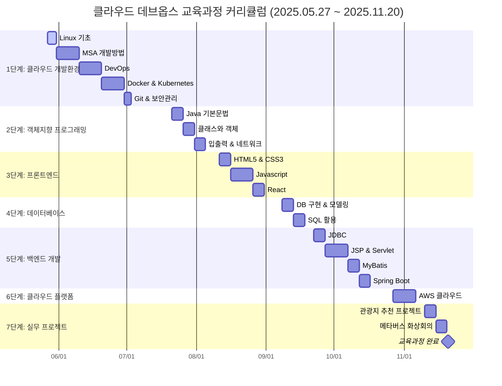
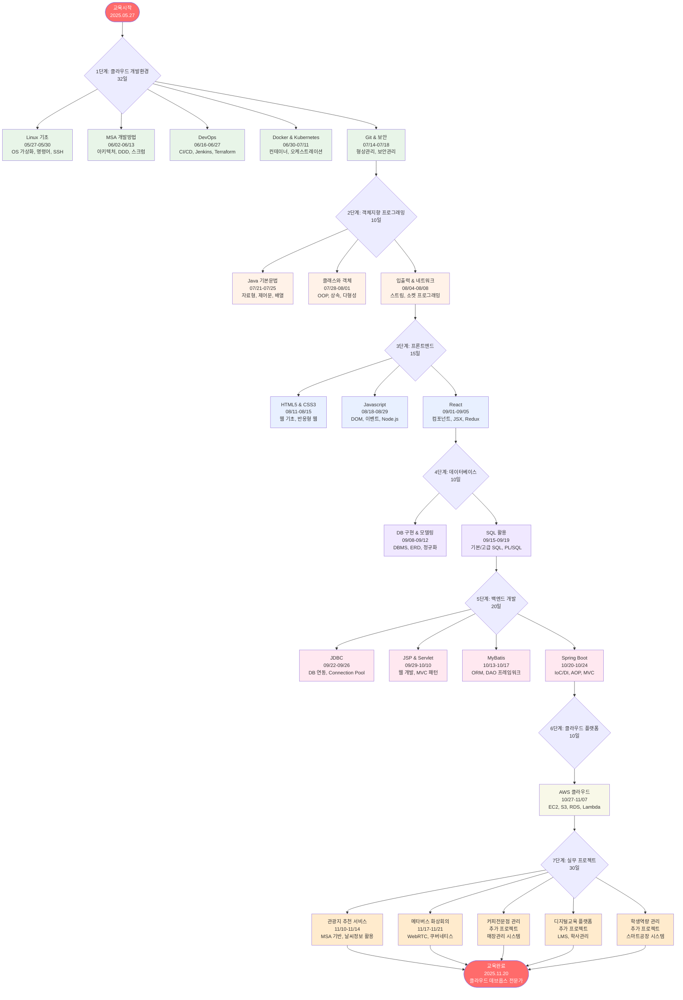

# 클라우드 데브옵스 교육과정 커리큘럼

## 📋 교육 개요

- **교육기간**: 2025년 05월 27일(화) ~ 2025년 11월 20일(목)
- **총 교육일수**: 177일 (약 6개월)
- **교육기관**: 중앙정보처리학원 / 중앙정보기술인재개발원

## 📅 교육 일정 (간트 차트)

## 🔄 교육과정 흐름도

## 📚 단계별 상세 커리큘럼

### 1단계: 클라우드 개발환경 이해 및 구축 (32일)

| 주차 | 교육기간 | 교과목명 | 세부내용 |
|------|----------|----------|----------|
| 1주 | 05/27~05/30 | Linux | OS 가상화 및 Linux 설치, Linux 기본 명령어와 환경변수 설정, 파일과 디렉토리 관리, 원격 서버연결(SSH), 프로세스 관리, 웹 애플리케이션 서비스 개발 환경 설정 |
| 2-3주 | 06/02~06/13 | MSA 개발방법 | MSA개념과 주요 특징, 모놀리식/SOA/MSA 특성비교, 도메인 주도 설계(DDD), 스크럼 생명주기, 아키텍처 정의와 마이크로서비스 도출, 스프린트내 개발 공정, 마이크로 서비스 데이터 관리 및 통신, 자동 테스트 |
| 4-5주 | 06/16~06/27 | DevOps | 소프트웨어 개발 라이프 사이클 DevOps 이해, CI/CD를 위한 젠킨스, TerraForm 배포 툴, CD 파이프라인, 소프트웨어 개발과 서버리스 배포 |
| 6-7주 | 06/30~07/11 | Docker & Kubernetes | 컨테이너 기술과 도커 동작원리, 도커 설치 및 명령어, 도커파일 활용, Docker Compose, 쿠버네티스 개요 및 클러스터 설치, 주요 오브젝트, 트러블 슈팅, 애플리케이션 배포, 모니터링 |
| 8주 | 07/14~07/18 | Git & 보안관리 | Git 설치 및 사용법, 버전관리 시스템, GitHub Desktop, 브런치 배포전략, JSON/XML 데이터 포맷, 클라우드 자산 관리와 보호, 취약점 관리, 네트워크 보안, 보안 침해 사고 탐지 및 대응 |

### 2단계: 클라우드 객체지향 프로그래밍 (10일)

| 주차 | 교육기간 | 교과목명 | 세부내용 |
|------|----------|----------|----------|
| 9주 | 07/21~07/25 | Java 기본문법 | 식별자, 자료형, 연산자, 제어문, 반복문, 배열, 기본 알고리즘과 로직학습 |
| 10주 | 07/28~08/01 | 클래스와 객체 | 객체지향 이해, 클래스 설계, 정보은닉, 상속, 메소드 오버로딩/오버라이딩, 다형성, 추상클래스, 인터페이스, 패키지, 예외처리, 래퍼클래스, 제네릭, 컬렉션, 람다식, 쓰레드, 동기화 |
| 11주 | 08/04~08/08 | 입출력 스트림 & 네트워크 | InputStream, OutputStream, 바이트/문자 스트림, ObjectStream 직렬화, TCP/IP, 서버와 클라이언트 소켓 프로그래밍, 채팅 프로그래밍 |

### 3단계: 클라우드 프론트엔드 개발 (15일)

| 주차 | 교육기간 | 교과목명 | 세부내용 |
|------|----------|----------|----------|
| 12주 | 08/11~08/15 | HTML5 & CSS3 | HTML 문서 기본구조, HTML5 주요 태그와 시맨택 태그, CSS3 속성/스타일/레이아웃 설정, 반응형 웹, Bootstrap |
| 13-14주 | 08/18~08/29 | Javascript | Javascript 기본문법, 내장함수/객체, DOM 적용, 이벤트 처리, TypeScript, Node.js 설치, npm/yarn 설치 |
| 15주 | 09/01~09/05 | React | React 개발 환경, 컴포넌트 클래스 생성, JSX, 라이프사이클 이벤트, 폼과 이벤트, React 라우팅, Redux와 GraphQL, Jest 단위 테스트 |

### 4단계: 클라우드 데이터베이스 구축 및 활용 (10일)

| 주차 | 교육기간 | 교과목명 | 세부내용 |
|------|----------|----------|----------|
| 16주 | 09/08~09/12 | 데이터베이스 구현 | DBMS 개요, 계정 및 권한, 데이터베이스 객체(데이터베이스, 테이블, 뷰), DB 모델링(개념, 논리, 물리), 데이터 무결성 제약조건, 정규화, ERD |
| 17주 | 09/15~09/19 | SQL 활용 및 응용 | 기본SQL(DBL, DDL, DML, DCL), 고급SQL(테이블 조인, 내부/외부/셀프 조인), PL/SQL, 저장 프로시저, 트리거 |

### 5단계: 클라우드 서버 백엔드 개발 (20일)

| 주차 | 교육기간 | 교과목명 | 세부내용 |
|------|----------|----------|----------|
| 18주 | 09/22~09/26 | JDBC | JDBC 드라이브를 이용한 데이터베이스 연동, Connection/Statement/PreparedStatement 객체, Connection Pool을 이용한 JDBC 처리 |
| 19-20주 | 09/29~10/10 | JSP & Servlet | JSP 페이지 기본구조, 디렉티브, 스크립트 요소, 내장객체, 자바빈, 액션 태그, 쿠키와 세션, JSTL, 파일 업로드, MVC 패턴, Model2 구조, 서블릿 라이프 사이클 |
| 21주 | 10/13~10/17 | MyBatis | MyBatis 구조 이해, CRUD, REST API, DAO 프레임워크, PL/SQL 프로시저와 함수 호출 |
| 22주 | 10/20~10/24 | Spring Boot | 스프링 클라우드 분산처리, 스프링 컨테이너, Spring IOC/DI/AOP/JDBC, 관점지향 프로그래밍, 트랜잭션 처리, Spring MVC/ORM, Maven/gradle, Lombok, Thymeleaf, JPA |

### 6단계: 클라우드 플랫폼 기반 서비스 운영 (10일)

| 주차 | 교육기간 | 교과목명 | 세부내용 |
|------|----------|----------|----------|
| 23-24주 | 10/27~11/07 | AWS 클라우드 웹서비스 | Public Cloud 개요, Amazon EC2, Route 53, S3, RDS, Kinesis, SWF/SQS/SNS/Lambda, ElastiCache, CloudWatch, 컨테이너 서비스, Elastic Beanstalk |

### 7단계: 실무 프로젝트 (30일)

| 주차 | 교육기간 | 프로젝트명 | 세부내용 |
|------|----------|------------|----------|
| 25주 | 11/10~11/14 | MSA 기반 관광지 추천 | 대기오염 정보 및 날씨 정보 활용 관광지 & 캠핑장 추천 서비스 프로젝트 |
| 26주 | 11/17~11/21 | 메타버스 화상회의 | 쿠버네티스 구축, 메타버스 기반 WebRTC 화상회의, 화상공연 솔루션 프로젝트 |
| 추가 | 진행중 | 커피전문점 관리 | MSA기반 커피 전문점 매장관리 서비스 솔루션 구축 프로젝트 |
| 추가 | 진행중 | 디지털교육 플랫폼 | 클라우드 기반 차세대 디지털교육 통합 플랫폼 구축 |
| 추가 | 진행중 | 학생역량 통합관리 | 클라우드 기반 학생역량 통합관리, MSA활용 스마트공장의 생산물류 시스템 개발 |

## 🎯 교육 목표

본 교육과정을 통해 다음과 같은 역량을 갖춘 **클라우드 데브옵스 전문가**를 양성합니다:

1. **클라우드 네이티브 개발**: MSA, 컨테이너, 쿠버네티스 활용 능력
2. **풀스택 개발**: 프론트엔드부터 백엔드까지 전 영역 개발 역량
3. **DevOps 실무**: CI/CD, 자동화, 모니터링 구축 능력
4. **실무 프로젝트**: 5개의 실제 서비스 구축 경험
5. **AWS 클라우드**: 퍼블릭 클라우드 서비스 활용 전문성

---

*교육과정 수료 후 클라우드 데브옵스 분야의 전문가로서 실무에 바로 투입 가능한 인재가 됩니다.*