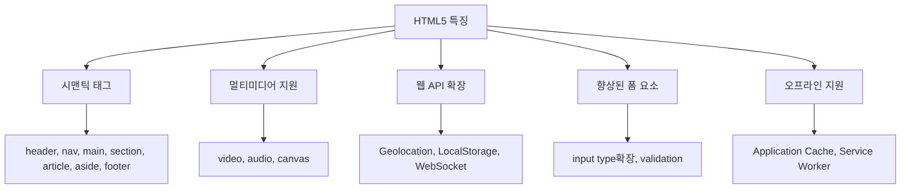
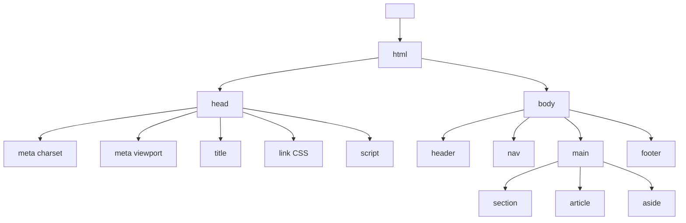
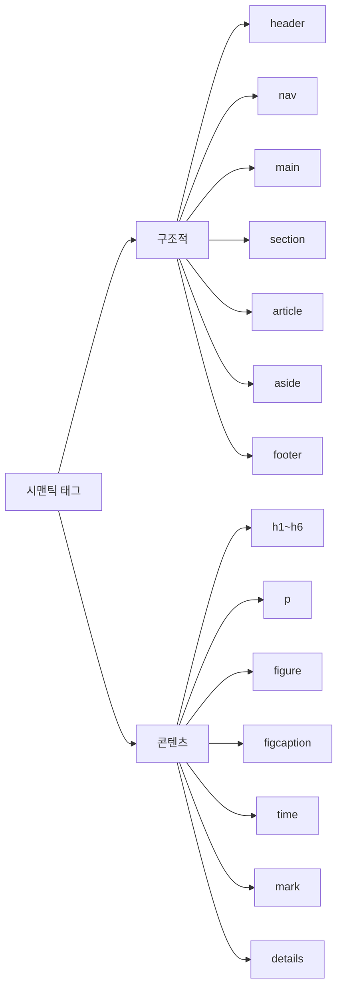
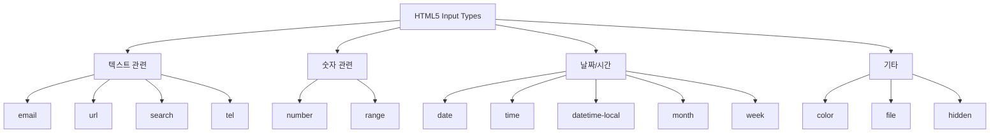
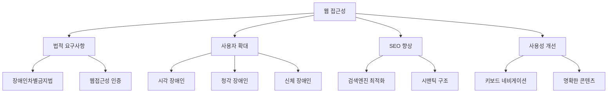
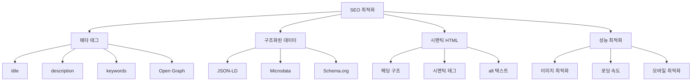

# HTML5 기본 숙지사항 - 취준생용 강의자료

## 📋 목차
1. [HTML5 개요](#html5-개요)
2. [문서 구조](#문서-구조)
3. [시맨틱 요소](#시맨틱-요소)
4. [폼 요소](#폼-요소)
5. [멀티미디어](#멀티미디어)
6. [접근성](#접근성)
7. [SEO 최적화](#seo-최적화)
8. [실무 체크리스트](#실무-체크리스트)

---

## HTML5 개요

### HTML5란?
- **HyperText Markup Language version 5**
- 웹 문서의 구조와 의미를 정의하는 마크업 언어
- 2014년 W3C 표준 권고안 발표
- 웹 표준의 현재 기준

### HTML5의 주요 특징


### 브라우저 지원 현황
- **모던 브라우저**: Chrome 4+, Firefox 3.5+, Safari 4+, Edge 12+
- **IE 지원**: IE 9+ (부분 지원)
- **모바일**: iOS Safari 3.2+, Android 2.1+

---

## 문서 구조

### 기본 HTML5 문서 구조
```html
<!DOCTYPE html>
<html lang="ko">
<head>
    <meta charset="UTF-8">
    <meta name="viewport" content="width=device-width, initial-scale=1.0">
    <title>페이지 제목</title>
</head>
<body>
    <!-- 콘텐츠 영역 -->
</body>
</html>
```

### DOCTYPE 선언
```html
<!-- HTML5 DOCTYPE (간소화됨) -->
<!DOCTYPE html>

<!-- 이전 버전 (복잡함) -->
<!DOCTYPE HTML PUBLIC "-//W3C//DTD HTML 4.01//EN" "http://www.w3.org/TR/html4/strict.dtd">
```

### 문서 구조 다이어그램


### 필수 메타 태그
```html
<head>
    <!-- 문자 인코딩 -->
    <meta charset="UTF-8">
    
    <!-- 반응형 웹 -->
    <meta name="viewport" content="width=device-width, initial-scale=1.0">
    
    <!-- SEO 기본 -->
    <meta name="description" content="페이지 설명">
    <meta name="keywords" content="키워드1, 키워드2">
    <meta name="author" content="작성자명">
    
    <!-- 소셜 미디어 (Open Graph) -->
    <meta property="og:title" content="페이지 제목">
    <meta property="og:description" content="페이지 설명">
    <meta property="og:image" content="이미지 URL">
    <meta property="og:url" content="페이지 URL">
    
    <!-- 파비콘 -->
    <link rel="icon" href="/favicon.ico">
    <link rel="apple-touch-icon" href="/apple-touch-icon.png">
</head>
```

---

## 시맨틱 요소

### 시맨틱 HTML이란?
- **의미가 있는 HTML**: 태그가 콘텐츠의 의미를 명확히 전달
- **기계 판독성**: 검색엔진, 스크린리더가 이해하기 쉬움
- **유지보수성**: 개발자가 코드를 이해하기 쉬움

### 주요 시맨틱 태그


### 페이지 레이아웃 구조
```html
<!DOCTYPE html>
<html lang="ko">
<head>
    <meta charset="UTF-8">
    <title>시맨틱 레이아웃</title>
</head>
<body>
    <!-- 페이지 헤더 -->
    <header>
        <h1>사이트 제목</h1>
        <nav>
            <ul>
                <li><a href="#home">홈</a></li>
                <li><a href="#about">소개</a></li>
                <li><a href="#contact">연락처</a></li>
            </ul>
        </nav>
    </header>
    
    <!-- 메인 콘텐츠 -->
    <main>
        <!-- 섹션: 테마별 콘텐츠 그룹 -->
        <section id="about">
            <h2>회사 소개</h2>
            
            <!-- 아티클: 독립적인 콘텐츠 -->
            <article>
                <h3>우리의 역사</h3>
                <p>회사 설립 스토리...</p>
                <time datetime="2020-01-01">2020년 1월 1일</time>
            </article>
            
            <article>
                <h3>우리의 비전</h3>
                <p>회사 비전...</p>
            </article>
        </section>
        
        <section id="services">
            <h2>서비스</h2>
            <article>
                <h3>웹 개발</h3>
                <p>서비스 설명...</p>
                
                <!-- 이미지와 캡션 -->
                <figure>
                    
                    <figcaption>최근 완성한 웹 개발 프로젝트</figcaption>
                </figure>
            </article>
        </section>
    </main>
    
    <!-- 사이드바 -->
    <aside>
        <h3>최근 소식</h3>
        <ul>
            <li>새로운 프로젝트 시작</li>
            <li>팀원 모집 중</li>
        </ul>
    </aside>
    
    <!-- 페이지 푸터 -->
    <footer>
        <p>&copy; 2025 회사명. All rights reserved.</p>
        <address>
            연락처: <a href="mailto:info@company.com">info@company.com</a>
        </address>
    </footer>
</body>
</html>
```

### 잘못된 vs 올바른 사용법
```html
<!-- ❌ 잘못된 예 -->
<div class="header">
    <div class="nav">
        <div class="menu-item">홈</div>
    </div>
</div>
<div class="content">
    <div class="post">
        <div class="title">제목</div>
        <div class="text">내용</div>
    </div>
</div>

<!-- ✅ 올바른 예 -->
<header>
    <nav>
        <ul>
            <li><a href="/">홈</a></li>
        </ul>
    </nav>
</header>
<main>
    <article>
        <h1>제목</h1>
        <p>내용</p>
    </article>
</main>
```

---

## 폼 요소

### HTML5 새로운 입력 타입


### 입력 타입별 활용법
```html
<!-- 이메일 (자동 검증) -->
<input type="email" name="email" placeholder="user@example.com" required>

<!-- 전화번호 (모바일에서 숫자 키패드) -->
<input type="tel" name="phone" pattern="[0-9]{3}-[0-9]{4}-[0-9]{4}" placeholder="010-1234-5678">

<!-- 숫자 (스피너 제공) -->
<input type="number" name="age" min="18" max="100" step="1">

<!-- 범위 (슬라이더) -->
<input type="range" name="volume" min="0" max="100" value="50">

<!-- 날짜 (날짜 피커) -->
<input type="date" name="birthday" min="1900-01-01" max="2025-12-31">

<!-- 색상 (컬러 피커) -->
<input type="color" name="theme-color" value="#3498db">

<!-- 파일 (파일 탐색기) -->
<input type="file" name="avatar" accept="image/*" multiple>
```

### 폼 검증 속성
```html
<form novalidate>
    <!-- 필수 입력 -->
    <input type="text" name="username" required>
    
    <!-- 길이 제한 -->
    <input type="text" name="nickname" minlength="2" maxlength="20">
    
    <!-- 패턴 검증 (정규식) -->
    <input type="text" name="phone" pattern="[0-9]{3}-[0-9]{4}-[0-9]{4}">
    
    <!-- 숫자 범위 -->
    <input type="number" name="age" min="18" max="100">
    
    <!-- 자동완성 -->
    <input type="email" name="email" autocomplete="email">
    
    <!-- 자동 포커스 -->
    <input type="text" name="search" autofocus>
    
    <!-- 읽기 전용 -->
    <input type="text" name="id" readonly value="user123">
    
    <!-- 비활성화 -->
    <input type="text" name="disabled-field" disabled>
</form>
```

### 완전한 폼 예제
```html
<form action="/submit" method="POST" enctype="multipart/form-data">
    <fieldset>
        <legend>개인 정보</legend>
        
        <div class="form-group">
            <label for="name">이름 *</label>
            <input type="text" id="name" name="name" required 
                   minlength="2" maxlength="50" 
                   placeholder="홍길동">
        </div>
        
        <div class="form-group">
            <label for="email">이메일 *</label>
            <input type="email" id="email" name="email" required 
                   placeholder="user@example.com">
        </div>
        
        <div class="form-group">
            <label for="age">나이</label>
            <input type="number" id="age" name="age" 
                   min="18" max="100" step="1">
        </div>
    </fieldset>
    
    <fieldset>
        <legend>추가 정보</legend>
        
        <div class="form-group">
            <label for="gender">성별</label>
            <select id="gender" name="gender">
                <option value="">선택하세요</option>
                <option value="male">남성</option>
                <option value="female">여성</option>
                <option value="other">기타</option>
            </select>
        </div>
        
        <div class="form-group">
            <fieldset>
                <legend>관심 분야</legend>
                <label>
                    <input type="checkbox" name="interests" value="web">
                    웹 개발
                </label>
                <label>
                    <input type="checkbox" name="interests" value="mobile">
                    모바일 개발
                </label>
                <label>
                    <input type="checkbox" name="interests" value="ai">
                    AI/ML
                </label>
            </fieldset>
        </div>
        
        <div class="form-group">
            <label for="message">메시지</label>
            <textarea id="message" name="message" rows="5" 
                      placeholder="추가로 전달하고 싶은 내용을 입력하세요"></textarea>
        </div>
    </fieldset>
    
    <div class="form-actions">
        <button type="submit">제출</button>
        <button type="reset">초기화</button>
    </div>
</form>
```

---

## 멀티미디어

### 이미지 최적화
```html
<!-- 기본 이미지 -->


<!-- 반응형 이미지 -->


<!-- Picture 요소 (다양한 이미지 포맷) -->
<picture>
    <source srcset="image.webp" type="image/webp">
    <source srcset="image.jpg" type="image/jpeg">
    
</picture>

<!-- 지연 로딩 -->

```

### 비디오 요소
```html
<!-- 기본 비디오 -->
<video controls width="640" height="360">
    <source src="video.mp4" type="video/mp4">
    <source src="video.webm" type="video/webm">
    <p>브라우저가 비디오를 지원하지 않습니다.</p>
</video>

<!-- 고급 비디오 설정 -->
<video controls autoplay muted loop poster="thumbnail.jpg">
    <source src="video-hd.mp4" type="video/mp4">
    <source src="video-hd.webm" type="video/webm">
    <track kind="subtitles" src="subtitles-ko.vtt" srclang="ko" label="한국어">
    <track kind="subtitles" src="subtitles-en.vtt" srclang="en" label="English">
</video>
```

### 오디오 요소
```html
<!-- 기본 오디오 -->
<audio controls>
    <source src="audio.mp3" type="audio/mpeg">
    <source src="audio.ogg" type="audio/ogg">
    <p>브라우저가 오디오를 지원하지 않습니다.</p>
</audio>

<!-- 배경 음악 (자동 재생 제한 주의) -->
<audio autoplay loop muted>
    <source src="background.mp3" type="audio/mpeg">
</audio>
```

---

## 접근성

### 접근성이 중요한 이유


### ARIA 속성 활용
```html
<!-- 역할 정의 -->
<nav role="navigation" aria-label="메인 네비게이션">
    <ul>
        <li><a href="/" aria-current="page">홈</a></li>
        <li><a href="/about">회사소개</a></li>
    </ul>
</nav>

<!-- 상태 정보 -->
<button aria-expanded="false" aria-controls="dropdown-menu">
    메뉴 열기
</button>
<ul id="dropdown-menu" aria-hidden="true">
    <li><a href="#">서브메뉴 1</a></li>
    <li><a href="#">서브메뉴 2</a></li>
</ul>

<!-- 설명 연결 -->
<input type="password" id="password" aria-describedby="pwd-help">
<div id="pwd-help">비밀번호는 8자 이상이어야 합니다.</div>

<!-- 라이브 영역 (동적 콘텐츠) -->
<div aria-live="polite" id="status">
    <!-- 상태 메시지가 여기에 표시됩니다 -->
</div>

<!-- 스크린 리더 전용 텍스트 -->
<span class="sr-only">현재 페이지: </span>
<h1>메인 페이지</h1>
```

### 키보드 네비게이션
```html
<!-- 건너뛰기 링크 -->
<a href="#main-content" class="skip-link">메인 콘텐츠로 건너뛰기</a>

<!-- 탭 순서 조정 -->
<input type="text" tabindex="1">
<input type="text" tabindex="2">
<input type="text" tabindex="3">

<!-- 포커스 관리 -->
<button onclick="focusNextElement()">다음 요소로 포커스 이동</button>
```

---

## SEO 최적화

### 검색엔진 최적화 요소


### 구조화된 데이터 (JSON-LD)
```html
<script type="application/ld+json">
{
  "@context": "https://schema.org",
  "@type": "Person",
  "name": "김개발",
  "jobTitle": "프론트엔드 개발자",
  "worksFor": {
    "@type": "Organization",
    "name": "테크 회사"
  },
  "url": "https://kimdev.com",
  "sameAs": [
    "https://github.com/kimdev",
    "https://linkedin.com/in/kimdev"
  ]
}
</script>
```

### 올바른 헤딩 구조
```html
<!-- ✅ 올바른 헤딩 구조 -->
<h1>메인 제목</h1>
    <h2>섹션 제목 1</h2>
        <h3>하위 제목 1-1</h3>
        <h3>하위 제목 1-2</h3>
    <h2>섹션 제목 2</h2>
        <h3>하위 제목 2-1</h3>

<!-- ❌ 잘못된 헤딩 구조 -->
<h1>메인 제목</h1>
<h3>섹션 제목</h3>  <!-- h2를 건너뛰면 안됨 -->
<h2>하위 제목</h2>   <!-- 계층 구조 무시 -->
```

---

## 실무 체크리스트

### 📋 HTML 품질 체크리스트

#### 문서 구조
- [ ] DOCTYPE HTML5 선언
- [ ] `lang` 속성 설정
- [ ] `charset` UTF-8 설정
- [ ] `viewport` 메타 태그 포함

#### 시맨틱 마크업
- [ ] 적절한 시맨틱 태그 사용
- [ ] 논리적인 헤딩 구조 (h1-h6)
- [ ] `main` 태그는 페이지당 하나만 사용
- [ ] `section`, `article` 구분 명확

#### 접근성
- [ ] 모든 이미지에 `alt` 속성
- [ ] 폼 요소에 `label` 연결
- [ ] 키보드로 모든 기능 접근 가능
- [ ] 적절한 ARIA 속성 사용

#### 성능
- [ ] 이미지 최적화 (WebP, lazy loading)
- [ ] 불필요한 중첩 태그 제거
- [ ] 인라인 스타일 최소화

#### SEO
- [ ] `title` 태그 최적화 (50-60자)
- [ ] `meta description` 작성 (150-160자)
- [ ] Open Graph 태그 포함
- [ ] 구조화된 데이터 적용

### 🛠️ 개발 도구 추천

#### 검증 도구
- **HTML Validator**: https://validator.w3.org/
- **WAVE**: 웹 접근성 검사
- **Lighthouse**: 성능, SEO, 접근성 종합 검사
- **axe DevTools**: 접근성 검사 브라우저 확장

#### VS Code 확장 프로그램
```json
{
  "recommendations": [
    "htmlhint.vscode-htmlhint",
    "formulahendry.auto-rename-tag", 
    "bradlc.vscode-tailwindcss",
    "deque-systems.vscode-axe-linter",
    "ms-vscode.vscode-json"
  ]
}
```

### 📚 추가 학습 리소스

#### 공식 문서
- **MDN HTML**: https://developer.mozilla.org/ko/docs/Web/HTML
- **W3C HTML5**: https://www.w3.org/TR/html52/
- **WHATWG HTML**: https://html.spec.whatwg.org/

#### 접근성 가이드
- **웹 접근성 연구소**: http://www.wah.or.kr/
- **WCAG 2.1 가이드라인**: https://www.w3.org/WAI/WCAG21/quickref/

#### SEO 리소스
- **Google SEO 가이드**: https://developers.google.com/search/docs
- **Schema.org**: https://schema.org/
- **Open Graph**: https://ogp.me/

이 자료를 통해 HTML5의 기본기를 탄탄히 다질 수 있습니다. 다음으로 CSS3 기본 숙지사항을 만들어드릴까요?