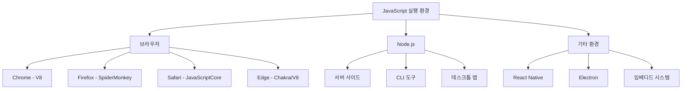
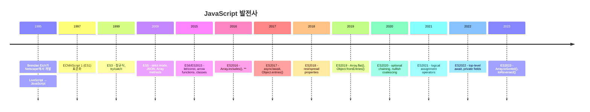
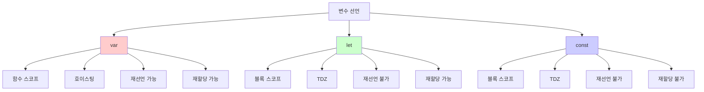
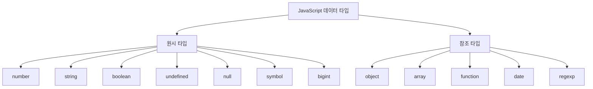
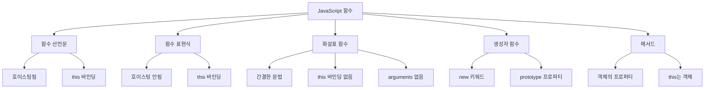

# JavaScript ES6+ 기본 숙지사항 - 취준생용 강의자료

## 📋 목차
1. [JavaScript 개요](#javascript-개요)
2. [변수와 데이터 타입](#변수와-데이터-타입)
3. [함수와 스코프](#함수와-스코프)
4. [객체와 배열](#객체와-배열)
5. [ES6+ 최신 문법](#es6-최신-문법)
6. [비동기 프로그래밍](#비동기-프로그래밍)
7. [DOM 조작](#dom-조작)
8. [실무 패턴](#실무-패턴)
9. [실무 체크리스트](#실무-체크리스트)

---

## JavaScript 개요

### JavaScript란?
- **동적 타입 프로그래밍 언어**
- 브라우저와 Node.js 환경에서 실행
- 인터프리터 언어 (런타임 시 해석)
- 프로토타입 기반 객체지향 언어
- 함수형 프로그래밍 지원

### JavaScript 엔진과 환경


### JavaScript 버전 히스토리


---

## 변수와 데이터 타입

### 변수 선언 방식 비교


### 변수 선언 예제
```javascript
// var (ES5) - 사용 지양
var name = "김개발";
var name = "이개발";  // 재선언 가능 (문제 소지)
name = "박개발";      // 재할당 가능

function example() {
  if (true) {
    var functionScoped = "함수 스코프";
  }
  console.log(functionScoped); // 접근 가능 (문제 소지)
}

// let (ES6) - 변경 가능한 값
let age = 25;
age = 26;           // 재할당 가능
// let age = 27;    // SyntaxError: 재선언 불가

function blockScopeExample() {
  if (true) {
    let blockScoped = "블록 스코프";
  }
  // console.log(blockScoped); // ReferenceError: 접근 불가
}

// const (ES6) - 상수
const PI = 3.14159;
// PI = 3.14;       // TypeError: 재할당 불가
// const EMPTY;     // SyntaxError: 초기값 필수

// 객체/배열은 내용 변경 가능
const user = { name: "김개발", age: 25 };
user.age = 26;      // 객체 프로퍼티 변경 가능
user.city = "서울"; // 새 프로퍼티 추가 가능

const colors = ["red", "green"];
colors.push("blue"); // 배열 요소 추가 가능
// colors = [];      // 배열 자체 재할당은 불가
```

### 데이터 타입


### 데이터 타입 예제
```javascript
// 원시 타입 (Primitive Types)
let num = 42;                    // number
let str = "Hello World";         // string
let bool = true;                 // boolean
let undef = undefined;           // undefined
let empty = null;                // null
let sym = Symbol("id");          // symbol (ES6)
let bigNum = 123n;              // bigint (ES2020)

// 참조 타입 (Reference Types)
let obj = { name: "김개발" };    // object
let arr = [1, 2, 3];            // array
let func = function() {};        // function
let date = new Date();          // date
let regex = /pattern/;          // regexp

// 타입 확인
console.log(typeof num);        // "number"
console.log(typeof str);        // "string"
console.log(typeof bool);       // "boolean"
console.log(typeof undef);      // "undefined"
console.log(typeof empty);      // "object" (주의!)
console.log(typeof sym);        // "symbol"
console.log(typeof bigNum);     // "bigint"
console.log(typeof obj);        // "object"
console.log(typeof arr);        // "object" (주의!)
console.log(typeof func);       // "function"

// 정확한 타입 확인
console.log(Array.isArray(arr));           // true
console.log(empty === null);               // true
console.log(Object.prototype.toString.call(arr)); // "[object Array]"

// 타입 변환
let numStr = "42";
let convertedNum = Number(numStr);         // 명시적 변환
let implicitNum = +numStr;                 // 암시적 변환
let parsedInt = parseInt(numStr, 10);      // 문자열을 정수로

let numToStr = String(42);                 // "42"
let boolToStr = String(true);              // "true"

// Falsy 값들
let falsyValues = [
  false,      // boolean false
  0,          // 숫자 0
  -0,         // 음수 0
  0n,         // BigInt 0
  "",         // 빈 문자열
  null,       // null
  undefined,  // undefined
  NaN         // Not a Number
];

// Truthy 값들 (Falsy가 아닌 모든 값)
let truthyValues = [
  true,       // boolean true
  1,          // 0이 아닌 숫자
  "false",    // 빈 문자열이 아닌 모든 문자열
  [],         // 빈 배열
  {},         // 빈 객체
  function(){} // 함수
];
```

---

## 함수와 스코프

### 함수 선언 방식


### 함수 선언 예제
```javascript
// 1. 함수 선언문 (Function Declaration)
function greet(name) {
  return `안녕하세요, ${name}님!`;
}

// 호이스팅으로 선언 전 호출 가능
console.log(add(2, 3)); // 5

function add(a, b) {
  return a + b;
}

// 2. 함수 표현식 (Function Expression)
const multiply = function(a, b) {
  return a * b;
};

// 3. 화살표 함수 (Arrow Function) - ES6
const subtract = (a, b) => {
  return a - b;
};

// 단축형 (중괄호 생략 시 암시적 반환)
const divide = (a, b) => a / b;

// 매개변수가 하나일 때 괄호 생략 가능
const square = x => x * x;

// 매개변수가 없을 때
const random = () => Math.random();

// 객체 반환 시 괄호 필요
const createUser = (name, age) => ({ name, age });

// 4. 즉시 실행 함수 (IIFE)
(function() {
  console.log("즉시 실행됩니다!");
})();

// 화살표 함수 IIFE
(() => {
  console.log("화살표 함수로 즉시 실행!");
})();

// 5. 고차 함수 (Higher-Order Function)
function createMultiplier(factor) {
  return function(number) {
    return number * factor;
  };
}

const double = createMultiplier(2);
const triple = createMultiplier(3);

console.log(double(5)); // 10
console.log(triple(4)); // 12

// 6. 콜백 함수
function processData(data, callback) {
  const result = data.map(item => item * 2);
  callback(result);
}

processData([1, 2, 3], function(result) {
  console.log("처리 결과:", result); // [2, 4, 6]
});
```

### 스코프와 클로저
```javascript
// 스코프 (Scope)
let globalVar = "전역 변수";

function outerFunction() {
  let outerVar = "외부 함수 변수";
  
  function innerFunction() {
    let innerVar = "내부 함수 변수";
    
    // 모든 스코프의 변수에 접근 가능
    console.log(globalVar);  // "전역 변수"
    console.log(outerVar);   // "외부 함수 변수"
    console.log(innerVar);   // "내부 함수 변수"
  }
  
  innerFunction();
  // console.log(innerVar); // ReferenceError: 접근 불가
}

// 클로저 (Closure)
function counter() {
  let count = 0;
  
  return {
    increment: function() {
      count++;
      return count;
    },
    decrement: function() {
      count--;
      return count;
    },
    getCount: function() {
      return count;
    }
  };
}

const myCounter = counter();
console.log(myCounter.increment()); // 1
console.log(myCounter.increment()); // 2
console.log(myCounter.getCount()); // 2

// 실용적인 클로저 예제
function createApiClient(baseUrl) {
  return {
    get: function(endpoint) {
      return fetch(`${baseUrl}${endpoint}`)
        .then(response => response.json());
    },
    post: function(endpoint, data) {
      return fetch(`${baseUrl}${endpoint}`, {
        method: 'POST',
        headers: { 'Content-Type': 'application/json' },
        body: JSON.stringify(data)
      }).then(response => response.json());
    }
  };
}

const apiClient = createApiClient('https://api.example.com');
// baseUrl이 클로저로 보존됨
```

### this 바인딩
```javascript
// this 바인딩 규칙
const user = {
  name: "김개발",
  
  // 일반 함수 - this는 호출한 객체
  greet: function() {
    console.log(`안녕하세요, ${this.name}님!`);
  },
  
  // 화살표 함수 - this는 상위 스코프 (여기서는 global)
  greetArrow: () => {
    console.log(`안녕하세요, ${this.name}님!`); // undefined
  },
  
  // 메서드 내부의 콜백에서 this 유지
  delayedGreet: function() {
    // 화살표 함수로 this 바인딩 유지
    setTimeout(() => {
      console.log(`안녕하세요, ${this.name}님!`);
    }, 1000);
  }
};

user.greet();      // "안녕하세요, 김개발님!"
user.greetArrow(); // "안녕하세요, undefined님!"

// call, apply, bind를 이용한 명시적 바인딩
function introduce() {
  console.log(`제 이름은 ${this.name}이고, 나이는 ${this.age}세입니다.`);
}

const person = { name: "이개발", age: 28 };

introduce.call(person);    // 즉시 실행
introduce.apply(person);   // 즉시 실행 (배열 인수)
const boundIntroduce = introduce.bind(person); // 바인딩된 함수 반환
boundIntroduce();

// 클래스에서의 this
class Calculator {
  constructor() {
    this.value = 0;
  }
  
  add(num) {
    this.value += num;
    return this; // 메서드 체이닝
  }
  
  multiply(num) {
    this.value *= num;
    return this;
  }
  
  getResult() {
    return this.value;
  }
}

const calc = new Calculator();
const result = calc.add(5).multiply(3).getResult(); // 15
```