# 클라우드 데브옵스 프론트엔드&백엔드 자바(JAVA) 풀스택 개발자 취업캠프 커리큘럼

## 📊 교육과정 플로우차트

아래 다이어그램은 전체 교육과정의 흐름을 보여줍니다. 각 단계는 순차적으로 진행되며, 7-8단계는 3단계 이후부터 병행 학습으로 진행됩니다.

```mermaid
flowchart TD
    Start([교육시작<br/>2025.05.27]) --> Phase1{1단계: 기반 기술 학습<br/>}

    Phase1 --> Cloud컴퓨팅[Cloud 컴퓨팅<br/><br/>개념]
    Phase1 --> Git[Git<br/><br/>형상관리, 보안관리]
    Phase1 --> Docker[Docker<br/><br/>컨테이너, 오케스트레이션]
    Phase1 --> Linux[Linux 기초<br/><br/>OS 가상화, 명령어, SSH]
    Phase1 --> DevOps[DevOps<br/><br/>CI/CD, Jenkins, Terraform]
    Phase1 --> MSA[MSA 개발방법<br/><br/>아키텍처, DDD, 스크럼]
    
    Docker --> Phase2{2단계: 웹 기초 기술<br/>}
    
    Phase2 --> HTML[HTML5<br/><br/>시맨틱 태그, 폼 요소]
    Phase2 --> CSS[CSS3<br/><br/>스타일링, 레이아웃]
    
    HTML --> HTMLSub1[기본 구조<br/>태그, 속성<br/>문서 구조화]
    HTML --> HTMLSub2[폼과 입력<br/>form, input<br/>validation]
    
    CSS --> CSSSub1[선택자와 속성<br/>박스 모델<br/>포지셔닝]
    CSS --> CSSSub2[Flexbox<br/>Grid Layout<br/>]
    
    HTMLSub2 --> JS[Javascript 기초<br/><br/>DOM 조작, 이벤트]
    CSSSub2 --> JS
    
    JS --> JSSub1[기본 문법<br/>변수, 함수<br/>객체, 배열]
    JS --> JSSub2[DOM 조작<br/>요소 선택<br/>스타일 변경]
    JS --> JSSub3[이벤트 처리<br/>클릭, 키보드<br/>폼 이벤트]
    JS --> JSSub4[비동기 처리<br/>Promise, async/await<br/>fetch API]
    
    JSSub4 --> Phase3{3단계: 객체지향 프로그래밍<br/>Java 기반}
    
    Phase3 --> Java1[Java 기본문법<br/><br/>자료형, 제어문, 배열, 메소드]
    
    Java1 --> JavaSub1[변수와 자료형<br/>기본형, 참조형<br/>형변환, 배열]
    Java1 --> JavaSub2[제어문<br/>조건문 if, switch<br/>반복문 for, while]
    Java1 --> JavaSub3[메소드<br/>정의, 호출, 매개변수<br/>return, 오버로딩]
    
    JavaSub1 --> Java2[클래스와 객체<br/><br/>OOP 핵심 개념]
    JavaSub2 --> Java2
    JavaSub3 --> Java2
    
    Java2 --> OOP1[캡슐화<br/>정보은닉<br/>접근제어자, getter/setter]
    Java2 --> OOP2[상속<br/>extends, super<br/>메소드 오버라이딩]
    Java2 --> OOP3[다형성<br/>추상클래스, 인터페이스<br/>업캐스팅, 다운캐스팅]
    Java2 --> OOP4[고급 개념<br/>제네릭, 컬렉션<br/>예외처리, 람다식]
    
    OOP1 --> Java3[입출력<br/><br/>실무 프로그래밍]
    OOP2 --> Java3
    OOP3 --> Java3
    OOP4 --> Java3
    
    Java3 --> IO1[입출력 스트림<br/>InputStream/OutputStream<br/>BufferedReader/Writer]
    Java3 --> IO2[파일 처리<br/>File 클래스<br/>직렬화/역직렬화]
    
    IO2 --> Phase4{4단계: 데이터베이스<br/><br/>심화 학습}
    
    Phase4 --> DB1[DB 구현 & 모델링<br/><br/>DBMS 기초, 설계]
    Phase4 --> DB2[SQL 활용<br/><br/>기본/고급 SQL]
    
    DB1 --> DBSub1[DBMS 개요<br/>관계형 DB 개념<br/>Oracle, MySQL 설치]
    DB1 --> DBSub2[데이터 모델링<br/>개념적, 논리적, 물리적<br/>모델링 단계]
    DB1 --> DBSub3[ERD 설계<br/>엔터티, 관계<br/>속성, 식별자]
    DB1 --> DBSub4[정규화<br/>1NF, 2NF, 3NF<br/>반정규화]
    
    DBSub1 --> DBMiddle[데이터 무결성<br/>제약조건 설계<br/>Primary Key, Foreign Key]
    DBSub2 --> DBMiddle
    DBSub3 --> DBMiddle
    DBSub4 --> DBMiddle
    
    DBMiddle --> DB2
    
    DB2 --> SQLSub1[기본 SQL<br/>DDL, DML, DCL<br/>CREATE, INSERT, SELECT]
    DB2 --> SQLSub2[고급 SQL<br/>JOIN, SubQuery<br/>집계함수, 그룹화]
    
    SQLSub1 --> SQLPractice[실습 프로젝트<br/>쇼핑몰 DB 설계<br/>테이블 생성 및 데이터 조작]
    SQLSub2 --> SQLPractice
    
    SQLPractice --> Phase5{5단계: 백엔드 개발<br/><br/>웹 서버 구축}
    
    Phase5 --> JDBC[JDBC<br/><br/>Java DB 연동]
    Phase5 --> WebDev[웹 개발 기초<br/><br/>JSP & Servlet]
    Phase5 --> Framework[프레임워크<br/><br/>MyBatis & Spring]
    
    JDBC --> JDBCSub1[JDBC 드라이버<br/>Connection 객체<br/>DriverManager]
    JDBC --> JDBCSub2[Statement vs PreparedStatement<br/>SQL Injection 방지<br/>ResultSet 처리]
    JDBC --> JDBCSub3[Connection Pool<br/>DBCP, HikariCP<br/>성능 최적화]
    JDBC --> JDBCSub4[트랜잭션 관리<br/>commit, rollback<br/>isolation level]
    
    JDBCSub1 --> WebDev
    JDBCSub2 --> WebDev
    JDBCSub3 --> WebDev
    JDBCSub4 --> WebDev
    
    WebDev --> JSPSub1[JSP 기초<br/>디렉티브, 스크립트릿<br/>내장 객체]
    WebDev --> JSPSub2[JSP 고급<br/>액션 태그, JSTL<br/>표현 언어 EL]
    WebDev --> ServletSub1[Servlet 기초<br/>라이프사이클<br/>request, response]
    
    JSPSub1 --> MVCPattern[MVC 패턴<br/>Model2 구조<br/>Controller, View 분리]
    JSPSub2 --> MVCPattern
    ServletSub1 --> MVCPattern
    
    MVCPattern --> WebProject[웹 프로젝트<br/>게시판 구현<br/>CRUD 기능]
    
    WebProject --> Framework
    
    Framework --> MyBatisPart[MyBatis<br/><br/>SQL 매퍼 프레임워크]
    Framework --> SpringPart[Spring Boot<br/><br/>엔터프라이즈 프레임워크]
    
    MyBatisPart --> MyBSub1[MyBatis 설정<br/>configuration.xml<br/>mapper.xml]
    MyBatisPart --> MyBSub2[동적 SQL<br/>if, choose, foreach<br/>include, sql]
    MyBatisPart --> MyBSub3[DAO 패턴<br/>SqlSession<br/>Mapper 인터페이스]
    MyBatisPart --> MyBSub4[실습 프로젝트<br/>상품 관리 시스템<br/>REST API 구현]
    
    MyBSub4 --> SpringPart
    
    SpringPart --> SpringSub1[Spring 핵심<br/>IoC Container<br/>DI 의존성 주입]
    SpringPart --> SpringSub2[Spring AOP<br/>관점지향 프로그래밍<br/>Proxy, Advice]
    SpringPart --> SpringSub3[Spring MVC<br/>DispatcherServlet<br/>Handler Mapping]
    SpringPart --> SpringSub4[Spring Boot<br/>자동 설정<br/>스타터 의존성]
    SpringPart --> SpringSub5[Spring Data JPA<br/>ORM, Entity<br/>Repository 패턴]
    SpringPart --> SpringSub6[Spring Security<br/>인증, 인가<br/>JWT 토큰]
    
    SpringSub1 --> BackendProject[백엔드 종합 프로젝트<br/>RESTful API 서버<br/>사용자 관리 시스템]
    SpringSub2 --> BackendProject
    SpringSub3 --> BackendProject
    SpringSub4 --> BackendProject
    SpringSub5 --> BackendProject
    SpringSub6 --> BackendProject
    
    BackendProject --> Phase6{6단계: 모던 프론트엔드<br/><br/>React 기반}
    
    Phase6 --> Node[Node.js 환경<br/><br/>npm, yarn, 패키지 관리]
    Phase6 --> ReactBasic[React 기초<br/><br/>컴포넌트, JSX]
    Phase6 --> ReactAdvanced[React 심화<br/><br/>상태관리, 라우팅]
    
    Node --> NodeSub1[패키지 관리<br/>npm install<br/>package.json]
    Node --> NodeSub2[개발 환경<br/>create-react-app<br/>webpack, babel]
    
    ReactBasic --> ReactSub1[컴포넌트<br/>함수형, 클래스형<br/>props, state]
    ReactBasic --> ReactSub2[JSX 문법<br/>조건부 렌더링<br/>리스트 렌더링]
    ReactBasic --> ReactSub3[이벤트 처리<br/>폼 처리<br/>생명주기]
    
    ReactAdvanced --> ReactSub4[Hooks<br/>useState, useEffect<br/>커스텀 훅]
    ReactAdvanced --> ReactSub5[상태 관리<br/>Context API<br/>Redux]
    ReactAdvanced --> ReactSub6[라우팅<br/>React Router<br/>네비게이션]
    
    %% 7단계 클라우드 플랫폼 병행
    DevOps --> CloudPhase7[7단계: 도커, 클라우드 플랫폼<br/><br/>병행 진행]
    Java3 --> CloudPhase7
    CloudPhase7 --> AWSBasic[AWS 기초<br/><br/>EC2, S3]
    CloudPhase7 --> AWSAdvanced[AWS 고급<br/><br/>RDS]
    
    %% 8단계 실무 프로젝트 병행
    Java3 --> ProjectPhase8[8단계: 실무 프로젝트<br/><br/>병행 진행]
    SQLPractice --> ProjectPhase8
    BackendProject --> ProjectPhase8
    ReactSub6 --> ProjectPhase8
    AWSAdvanced --> ProjectPhase8
    
    ProjectPhase8 --> Proj1[OOO 서비스<br/>OO정보 활용]
    ProjectPhase8 --> Proj2[OOO 회의<br/>]
    ProjectPhase8 --> Proj3[OO전문점 관리<br/>OOOO 시스템]
    ProjectPhase8 --> Proj4[OOO 플랫폼<br/><br/>]
    ProjectPhase8 --> Proj5[OOOO 통합관리<br/>OOO 시스템]
    
    ReactSub6 --> Complete([교육완료<br/>2025.11.20<br/>])
    Proj5 --> Complete
    
    %% 접기 기능을 위한 서브그래프
    subgraph Phase1Detail [" "]
        direction TB
        Cloud컴퓨팅
        Docker
        Linux
        Git
        DevOps
        MSA
    end
    
    subgraph Phase2Detail [" "]
        direction TB
        HTML
        HTMLSub1
        HTMLSub2
        CSS
        CSSSub1
        CSSSub2
        JS
        JSSub1
        JSSub2
        JSSub3
        JSSub4
    end
    
    subgraph Phase3Detail [" "]
        direction TB
        Java1
        JavaSub1
        JavaSub2
        JavaSub3
        Java2
        OOP1
        OOP2
        OOP3
        OOP4
        Java3
        IO1
        IO2
    end
    
    subgraph Phase4Detail [" "]
        direction TB
        DB1
        DBSub1
        DBSub2
        DBSub3
        DBSub4
        DBMiddle
        DB2
        SQLSub1
        SQLSub2
        SQLPractice
    end
    
    subgraph Phase5Detail [" "]
        direction TB
        JDBC
        JDBCSub1
        JDBCSub2
        JDBCSub3
        JDBCSub4
        WebDev
        JSPSub1
        JSPSub2
        ServletSub1
        MVCPattern
        WebProject
        Framework
        MyBatisPart
        MyBSub1
        MyBSub2
        MyBSub3
        MyBSub4
        SpringPart
        SpringSub1
        SpringSub2
        SpringSub3
        SpringSub4
        SpringSub5
        SpringSub6
        BackendProject
    end
    
    subgraph Phase6Detail [" "]
        direction TB
        Node
        NodeSub1
        NodeSub2
        ReactBasic
        ReactSub1
        ReactSub2
        ReactSub3
        ReactAdvanced
        ReactSub4
        ReactSub5
        ReactSub6
    end
    
    subgraph Phase7Detail [" "]
        direction TB
        CloudPhase7
        AWSBasic
        AWSAdvanced
    end
    
    subgraph Phase8Detail [" "]
        direction TB
        ProjectPhase8
        Proj1
        Proj2
        Proj3
        Proj4
        Proj5
    end
    
    classDef phase1 fill:#e8f5e8
    classDef phase2 fill:#e8f0ff
    classDef phase3 fill:#fff2e8
    classDef phase4 fill:#f0e8ff
    classDef phase5 fill:#ffe8f0
    classDef phase6 fill:#ffeaa7
    classDef phase7 fill:#f8f8e8
    classDef phase8 fill:#ffebcd
    classDef milestone fill:#ff6b6b,color:#fff
    
    class Linux,MSA,DevOps,Docker,Git,Cloud컴퓨팅 phase1
    class HTML,CSS,HTMLSub1,HTMLSub2,CSSSub1,CSSSub2,JS,JSSub1,JSSub2,JSSub3,JSSub4 phase2
    class Java1,Java2,Java3,JavaSub1,JavaSub2,JavaSub3,OOP1,OOP2,OOP3,OOP4,IO1,IO2 phase3
    class DB1,DB2,DBSub1,DBSub2,DBSub3,DBSub4,DBMiddle,SQLSub1,SQLSub2,SQLPractice phase4
    class JDBC,WebDev,Framework,JDBCSub1,JDBCSub2,JDBCSub3,JDBCSub4,JSPSub1,JSPSub2,ServletSub1,MVCPattern,WebProject,MyBatisPart,SpringPart,MyBSub1,MyBSub2,MyBSub3,MyBSub4,SpringSub1,SpringSub2,SpringSub3,SpringSub4,SpringSub5,SpringSub6,BackendProject phase5
    class Node,ReactBasic,ReactAdvanced,NodeSub1,NodeSub2,ReactSub1,ReactSub2,ReactSub3,ReactSub4,ReactSub5,ReactSub6 phase6
    class CloudPhase7,AWSBasic,AWSAdvanced phase7
    class ProjectPhase8,Proj1,Proj2,Proj3,Proj4,Proj5 phase8
    class Start,Complete milestone
```

## 📋 단계별 학습 내용

### 1단계: 기반 기술 학습
- **Cloud 컴퓨팅**: 기본 개념 이해
- **Git**: 형상관리 및 보안관리
- **Docker**: 컨테이너 및 오케스트레이션
- **Linux 기초**: OS 가상화, 명령어, SSH
- **DevOps**: CI/CD, Jenkins, Terraform
- **MSA 개발방법**: 아키텍처, DDD, 스크럼

### 2단계: 웹 기초 기술
- **HTML5**: 시맨틱 태그, 폼 요소, 문서 구조화
- **CSS3**: 스타일링, 레이아웃, Flexbox, Grid Layout
- **JavaScript**: DOM 조작, 이벤트 처리, 비동기 처리

### 3단계: 객체지향 프로그래밍 (Java 기반)
- **Java 기본문법**: 자료형, 제어문, 배열, 메소드
- **객체지향 개념**: 캡슐화, 상속, 다형성
- **고급 개념**: 제네릭, 컬렉션, 예외처리, 람다식
- **입출력 프로그래밍**: 스트림, 파일 처리, 직렬화

### 4단계: 데이터베이스
- **DB 구현 & 모델링**: DBMS 기초, ERD 설계, 정규화
- **SQL 활용**: 기본/고급 SQL, JOIN, SubQuery

### 5단계: 백엔드 개발
- **JDBC**: Java DB 연동, Connection Pool, 트랜잭션 관리
- **웹 개발 기초**: JSP, Servlet, MVC 패턴
- **프레임워크**: MyBatis, Spring Boot, Spring Security

### 6단계: 모던 프론트엔드 (React 기반)
- **Node.js 환경**: npm, yarn, 패키지 관리
- **React 기초**: 컴포넌트, JSX, props, state
- **React 심화**: Hooks, 상태관리, 라우팅

### 7단계: 클라우드 플랫폼 (병행 진행)
- **AWS 기초**: EC2, S3
- **AWS 고급**: RDS
- *3단계 완료 후부터 병행 학습*

### 8단계: 실무 프로젝트 (병행 진행)
- 5개의 실무 프로젝트 진행
- *3단계 완료 후부터 병행 학습*

## 📅 교육 일정
- **교육 시작**: 2025년 5월 27일
- **교육 완료**: 2025년 11월 20일
- **총 교육 기간**: 약 6개월